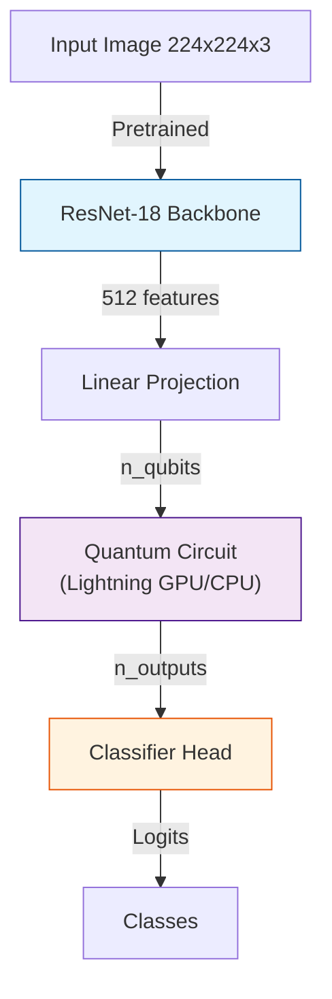

# Benchmarking Quantum Encodings in Hybrid Neural Networks for computer vision

   

Master's Thesis project comparing different quantum encoding techniques in hybrid quantum-classical neural networks for computer vision tasks.

## 🎯 Overview

This project implements and compares various quantum encoding techniques in hybrid architectures, providing a robust framework for benchmarking Quantum Transfer Learning strategies.

- **Backbone**: ResNet-18 pretrained on ImageNet (frozen for fair comparison)
- **Quantum Layer**: Variational Quantum Circuit (VQC) with interchangeable encodings
- **Encodings**: `basis`, `angle`, `amplitude`, `feature_map`, `hybrid_angle_zz`
- **Device**: PennyLane Lightning (CPU optimized) / Lightning GPU

## 🏗️ Architecture



## 📊 Results Preview

**Benchmark Summary (MNIST & CIFAR-10) for 8 qubits**
_Comparison of accuracy, gradient magnitude, and circuit complexity._

| Dataset     | Encoding Strategy        | Val Accuracy | Grad Norm | Circuit Depth | Gate Count | Circ. Time (ms) |
| :---------- | :----------------------- | :----------: | :-------: | :-----------: | :--------: | :-------------: |
| **MNIST**   | **Baseline (Classical)** |  **95.0%**   |  0.0000   |       0       |     0      |      0.00       |
| MNIST       | Feature Map              |    76.5%     |  0.1861   |      26       |     52     |      6.25       |
| MNIST       | Angle                    |    75.0%     |  0.4776   |       9       |     23     |      4.16       |
| MNIST       | Hybrid Angle+ZZ          |    64.6%     |  0.4666   |      25       |     44     |      6.17       |
| MNIST       | Basis                    |    28.4%     |  0.0619   |       9       |     16     |      3.65       |
|             |                          |              |           |               |            |                 |
| **CIFAR10** | **Baseline (Classical)** |  **77.7%**   |  0.0000   |       0       |     0      |      0.00       |
| CIFAR10     | Angle                    |    52.2%     |  0.4144   |       9       |     23     |      4.30       |
| CIFAR10     | Hybrid Angle+ZZ          |    47.4%     |  0.4235   |      25       |     44     |      6.19       |
| CIFAR10     | Feature Map              |    41.2%     |  0.0462   |      26       |     52     |      6.84       |
| CIFAR10     | Basis                    |    16.3%     |  0.0434   |       9       |     16     |      3.49       |

## 📦 Installation

**Prerequisites:** Python 3.12+

```bash
# Create virtual environment
python -m venv venv
source venv/bin/activate  # Linux/Mac
# or: venv\Scripts\activate  # Windows

# Install dependencies
pip install -r requirements.txt
```

### ⚡ GPU Acceleration (Optional)

This project supports **PennyLane Lightning GPU** for faster simulation. To use it, ensure you have NVIDIA drivers and CUDA installed, then run:

```bash
pip install pennylane-lightning-gpu
```

If not installed, the system automatically falls back to optimized CPU execution (`lightning.qubit`).

### 📂 Project Structure

```
.
├── configs/
│   └── default.yaml  # Default configuration
├── src/
│   ├── encodings/    # Quantum encoding strategies (angle, basis, etc.)
│   ├── cli.py        # Command-line interface entry point
│   ├── data.py       # Data loading and preprocessing
│   ├── metrics.py    # Custom metrics and circuit analysis
│   ├── model.py      # Hybrid and baseline model architectures
│   ├── train.py      # Training and validation loop
│   ├── utils.py      # Utility functions (seeding, device, etc.)
│   └── vqc.py        # Variational Quantum Circuit implementation
├── scripts/
│   ├── check_system.py     # System diagnostics and benchmarking
│   └── plot_all_results.py # Visualization script
├── outputs/          # Logs, models, and metrics
├── requirements.txt  # Project dependencies
└── EXPERIMENTS_GUIDE.md
```

## 🚀 Usage

This project uses a Python command-line interface (CLI). All experiments are run via `python -m src.cli`.

### 1. Diagnostics

Check if your environment (and GPU) is correctly set up:

```bash
python scripts/check_system.py
```

### 2. Quick Test

To verify everything works correctly (1 encoding, few epochs):

```bash
python -m src.cli --config configs/default.yaml \
    --override experiment=quick_test \
    --override optim.epochs=5 \
    --override dataset.max_train=500
```

### 3. Run a Full Experiment

To train a specific model (e.g., Angle Encoding with 8 qubits on MNIST):

```bash
python -m src.cli --config configs/default.yaml \
    --override model.encoding=angle \
    --override model.n_qubits=8 \
    --override model.n_layers=3 \
    --override dataset.name=mnist
```

### 4. Full Comparison

To reproduce the full comparison of all encodings:

```bash
# Run for each encoding (angle, feature_map, basis, hybrid_angle_zz, amplitude)
for encoding in angle feature_map basis hybrid_angle_zz amplitude; do
    python -m src.cli --config configs/default.yaml \
        --override model.encoding=$encoding \
        --override experiment=full_comparison
done

# Run classical baseline
python -m src.cli --config configs/default.yaml --override model.type=baseline
```

### 5. Generate Plots and Tables

Once experiments are complete, generate visualizations:

```bash
python scripts/plot_all_results.py
```

Results will be saved in `outputs/figures/`.

## 📊 Outputs

Results are saved in `outputs/`:

- `outputs/metrics/`: CSV files with training metrics
- `outputs/models/`: Best model checkpoints
- `outputs/logs/`: Training logs (automatically saved with timestamps)
- `outputs/figures/`: Plots and visualizations

## 🔧 Configuration

Key parameters in `configs/default.yaml`:

- **Dataset**: MNIST or CIFAR-10 (automatically resized to 224x224)
- **Model**:
  - `type`: "hybrid" (with VQC) or "baseline" (classical only)
  - `encoding`: "basis" | "angle" | "amplitude" | "feature_map" | "hybrid_angle_zz"
  - `n_qubits`: Number of qubits
  - `n_layers`: Depth of the Variational Quantum Circuit (Ansatz)
  - `freeze_backbone`: true (recommended for fair encoding comparison)
- **Training**:
  - `batch_size`, `epochs`, `learning_rate`
  - `optim.name`: "adam" | "sgd"
  - `seed`: Random seed for reproducibility

## 📈 Methodology

**Why pretrained frozen backbone?**

- Ensures fair comparison between encodings
- All encodings receive the same input features
- Faster training (only VQC + classifier trained)
- More stable with reduced datasets
- Standard practice in transfer learning

## 📚 References & Credits

The encodings implemented in this repository are based on or inspired by the following works:

- **Angle & Basis Encoding**: Standard textbook implementations (see _Nielsen & Chuang, Quantum Computation and Quantum Information_).
- **Amplitude Encoding**: Implements the algorithm by **Möttönen et al. (2004)** via PennyLane's `AmplitudeEmbedding`.
- **Feature Map (ZZ)**: Inspired by the ZZ-Feature Map from **Havlicek et al. (2019)** (_Nature_), with modified scaling factors for this specific benchmark.
- **Hybrid Angle-ZZ**: A custom hardware-efficient encoding proposed in this work, combining single-qubit rotations (Angle) with ZZ-entanglement to capture correlations with minimal depth.

## 🎓 Citation

If you use this code for your research, please cite it using the metadata in CITATION.cff or the following BibTeX:

@software{GiliZaragoza2025,
author = {Gili Zaragoza, Albert},
title = {Benchmarking Quantum Encodings in Hybrid Neural Networks for computer vision},
year = {2025},
url = {https://github.com/ivich123/tfm-quantum-encoding}
}

## 📜 License

This project is licensed under the **MIT License** - see the [LICENSE](LICENSE) file for details.
